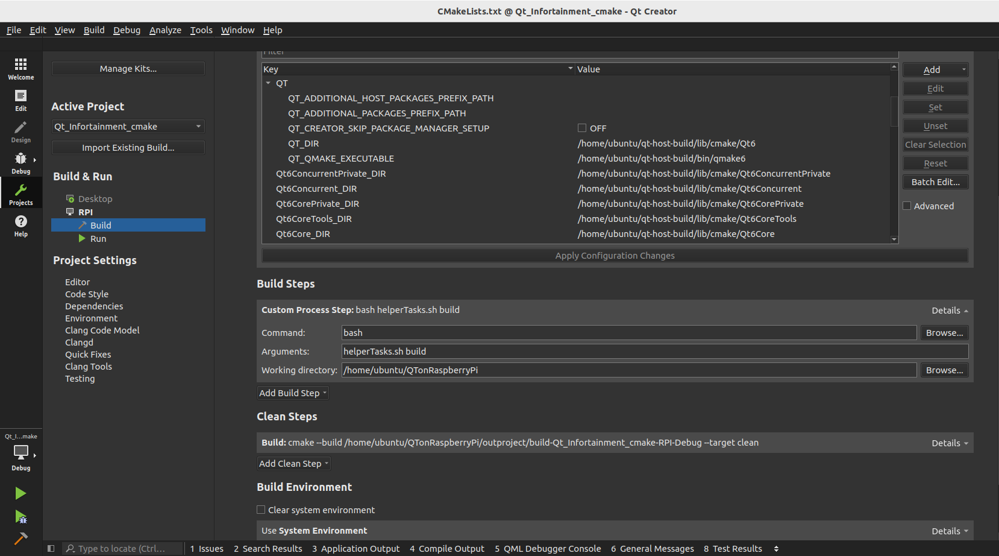
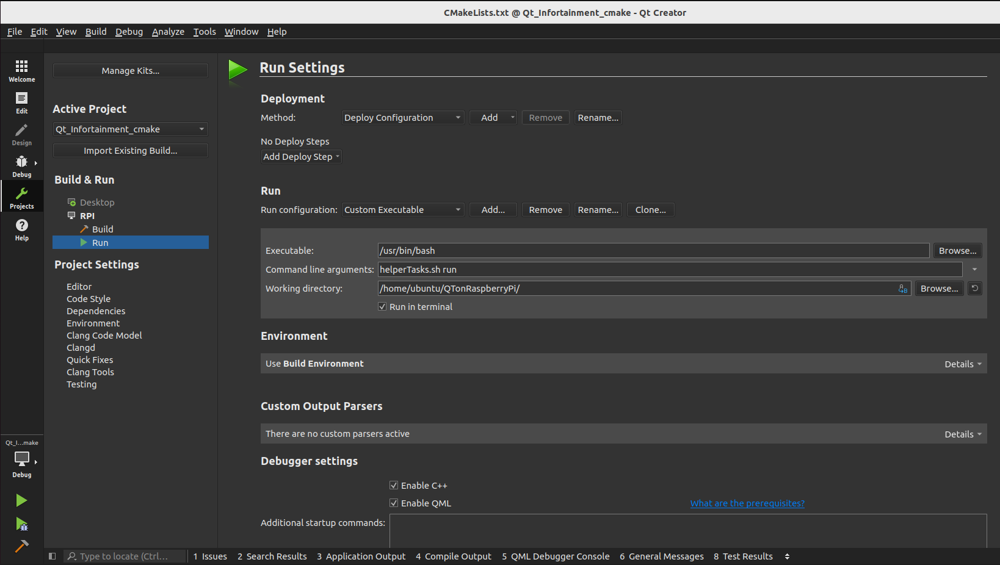
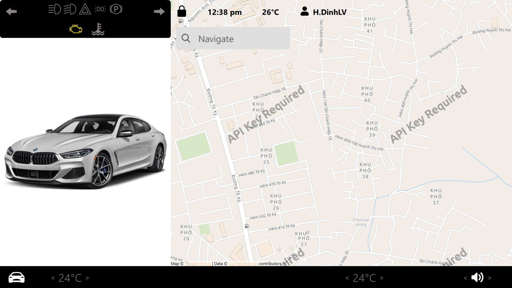

# Qt Cross-Compilation for Raspberry Pi 4 with Docker
> Cross-compile Qt 6 (HMI) applications for Raspberry Pi 4 using Docker + QEMU. Includes helper scripts to build, package and deploy remote Qt apps.

## Overview
This repository documents a Docker-based workflow to cross-compile Qt 6 applications (HMI) for Raspberry Pi 4 without needing the physical board during the build process. The approach packages a Raspbian-like rootfs inside Docker (via QEMU) and produces Qt binaries and runtime bundles that can be copied to a Raspberry Pi for testing and deployment. Benefits include environment isolation, reproducible builds, and easier dependency management compared to traditional toolchain/Rsync


## 🚀 Installation
### 1. Install Docker
*Note: These steps are for Ubuntu 22.04. Commands may vary for other versions.*
``` bash
ubuntu@raspi:~$ lsb_release -a
No LSB modules are available.
Distributor ID:	Ubuntu
Description:	Ubuntu 22.04.5 LTS
Release:	22.04
Codename:	jammy

```

**Install dependencies:**
```bash
sudo apt-get update
sudo apt-get install ca-certificates curl
sudo install -m 0755 -d /etc/apt/keyrings
sudo curl -fsSL [https://download.docker.com/linux/ubuntu/gpg](https://download.docker.com/linux/ubuntu/gpg) -o /etc/apt/keyrings/docker.asc
sudo chmod a+r /etc/apt/keyrings/docker.asc

```
**Set up the repository:**
``` bash
echo \
  "deb [arch=$(dpkg --print-architecture) signed-by=/etc/apt/keyrings/docker.asc] [https://download.docker.com/linux/ubuntu](https://download.docker.com/linux/ubuntu) \
  $(. /etc/os-release && echo "$VERSION_CODENAME") stable" | \
  sudo tee /etc/apt/sources.list.d/docker.list > /dev/null
sudo apt-get update

```
**Install Docker Engine:**
``` bash
sudo apt-get install docker-ce docker-ce-cli containerd.io docker-buildx-plugin docker-compose-plugin

```
*Note: Make sure docker installed. Following command below:*
``` bash
ubuntu@raspi:~$ sudo docker run hello-world

```
```bash
Unable to find image 'hello-world:latest' locally
latest: Pulling from library/hello-world
17eec7bbc9d7: Pull complete 
ea52d2000f90: Download complete 
Digest: sha256:05813aedc15fb7b4d732e1be879d3252c1c9c25d885824f6295cab4538cb85cd
Status: Downloaded newer image for hello-world:latest

Hello from Docker!
....
```
*This message shows that your installation appears to be working correctly.*

**Post-installation (Manage Docker as non-root)::**
``` bash
sudo usermod -aG docker ${USER}
su - ${USER}
sudo systemctl enable docker

```
### 2. Install QEMU
QEMU is required to emulate the ARM architecture (Raspbian OS) on your x86_64 host.
``` bash
sudo apt install qemu-system-x86 qemu-kvm libvirt-daemon-system libvirt-clients bridge-utils virt-manager

```
**Enable and Start Libvirt:**
```bash
sudo systemctl enable libvirtd
sudo systemctl start libvirtd
sudo usermod -aG libvirt $(whoami)
sudo usermod -aG kvm $(whoami)

```
**Verify QEMU/KVM:**
```bash
virsh list --all
# Output should be empty (no errors)

```

**Setup QEMU for multi-architecture support:**
```bash
docker run --rm --privileged multiarch/qemu-user-static --reset -p yes

```
**Configure Docker Buildx:**
```bash
docker buildx create --use --name mybuilder
docker buildx inspect mybuilder --bootstrap

```
## 🏗️ Build Process
**This workflow uses two Dockerfiles:**
1. ```DockerFileRasp```: Creates the Raspbian environment and compiles Qt base.
2. ```Dockerfile```: Builds the final cross-compilation toolchain image.

### Step 1: Create Raspbian Base Image

This step compiles Qt 6 and generates the sysroot.
```bash
docker buildx build --platform linux/arm64 --load -f DockerFileRasp -t raspimage .

```
Extract the compiled artifacts ```rasp.tar.gz```:
```bash
docker create --name temp-arm raspimage
docker cp temp-arm:/build/rasp.tar.gz ./rasp.tar.gz

```
```rasp.tar.gz``` contains all necessary Qt6 libraries and the Debian sysroot, replacing the need for manual rsync from the device.

### Step 2: Build the Final Toolchain Image

This image ```qtcrossbuild``` will be used to compile your applications.
```bash
docker build -t qtcrossbuild .

```
*Note: This process may take time depending on the Qt modules selected.*

**Verify the Build:**
```bash
docker create --name tmpbuild qtcrossbuild
docker run --rm -it tmpbuild bash
# Inside container:
cat ../build.log  # Check for errors

```

### Step 3: Test Compilation (HelloQt6)

The image contains a sample HelloQt6 binary. You can extract and inspect it:
```bash
docker cp tmpbuild:/build/project/HelloQt6 ./HelloQt6
file HelloQt6
# Output: HelloQt6: ELF 64-bit LSB executable, ARM aarch64, version 1 (SYSV), dynamically linked, interpreter /lib/ld-linux-aarch64.so.1, for GNU/Linux 3.7.0, with debug_info, not stripped

```

## 📲 Deployment & Running

### Method A: Manual Deployment

Transfer the Qt libraries and the application to the Raspberry Pi manually.

**1. Extract Qt binaries from Docker:**

```bash
docker cp tmpbuild:/build/qt-pi-binaries.tar.gz ./qt-pi-binaries.tar.gz
```

**2. Copy to Raspberry Pi:**

```bash 
scp qt-pi-binaries.tar.gz pi@<192.168.46.156:/home/pi/
```

**3. Install on Raspberry Pi:**

```bash
ssh -X pi@192.168.46.156
sudo mkdir /usr/local/qt6
sudo tar -xvf qt-pi-binaries.tar.gz -C /usr/local/qt6
export LD_LIBRARY_PATH=$LD_LIBRARY_PATH:/usr/local/qt6/lib/

```
Make sure ```LD_LIBRARY_PATH``` are available, we should see ```export LD_LIBRARY_PATH=$LD_LIBRARY_PATH:/usr/local/qt6/lib/``` on the end:
```bash
cat ~/.bashrc
source ~/.bashrc
```


```bash
./HelloQt6
```

### Method B: Automated Script (Recommended)

A helper script ```helperTasks.sh``` and a dedicated ```Dockerfile.app``` are provided to streamline building and deploying specific Qt projects.

**1. Build the Application:**

```bash
bash helperTasks.sh build
```
This uses the cached qtcrossbuild image to compile your project quickly.

**2. Deploy and Run:**

```bash
bash helperTasks.sh run
```

*Note: Edit ```helperTasks.sh``` to update your Raspberry Pi's IP address and paths before running.*

## 💻 Qt Creator Integration

Qt Creator offers a professional and convenient environment for visualizing and editing Qt projects. Consequently, performing tasks such as editing, building, and deploying directly within Qt Creator is highly efficient.

### 1. Install Qt Creator

```bash
sudo apt-get install qtcreator

```

### 2. Configure Project

- Import your project

- Select any Kit(ignore toolchain warnings as we use the script).

### 3. Setup Build Settings:

- Remove default build steps.

- Add a Custom Process Step:

  - Command: bash

  - Arguments: helperTasks.sh build

  - Working Directory: /home/ubuntu/QTonRaspberryPi/



### 4. Setup Run Settings:

Add a Custom Executable configuration.

  - Executable: bash

  - Arguments: helperTasks.sh run

  - Working Directory: Project source directory.



### Result

Running the project from Qt Creator will deploy the application and display the GUI on your host machine (via SSH X11 forwarding).



This interface serves as the primary HMI for the [Qt-Infotainment](https://github.com/haidinh-me/Qt-Infotainment) project, handling the visualization and processing of CAN bus packets from the vehicle.

## 🤝 Acknowledgments
This workflow references the "[Cross compilation of Qt6.10.1 and OpenCV For Raspberry pi 3/4/5](https://github.com/PhysicsX/QTonRaspberryPi)" guide. Huge thanks to @PhysicsX for the foundation and inspiration.
